<p align="center">
  
</p>

<h1 align="center">Paperboy</h1>

<table align="center">
  <tr>
    <td>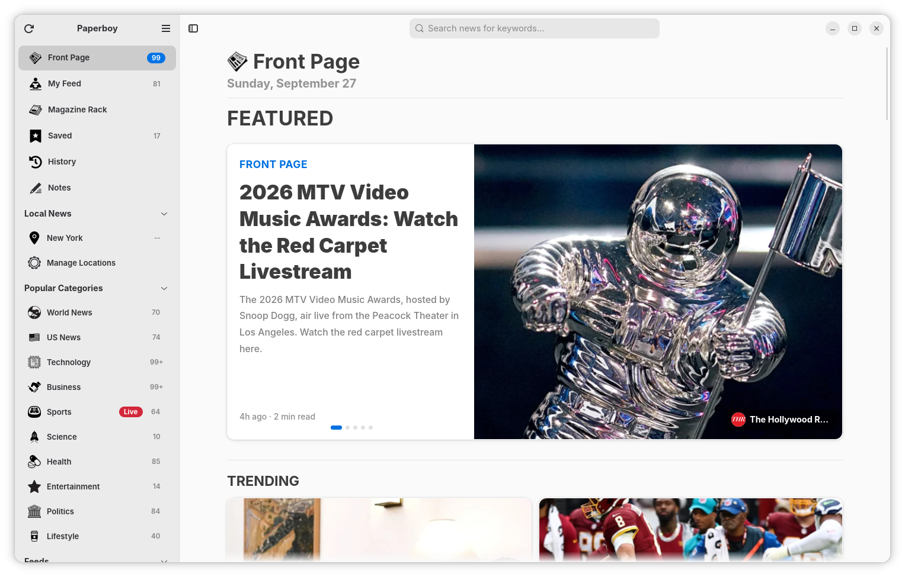</td>
    <td>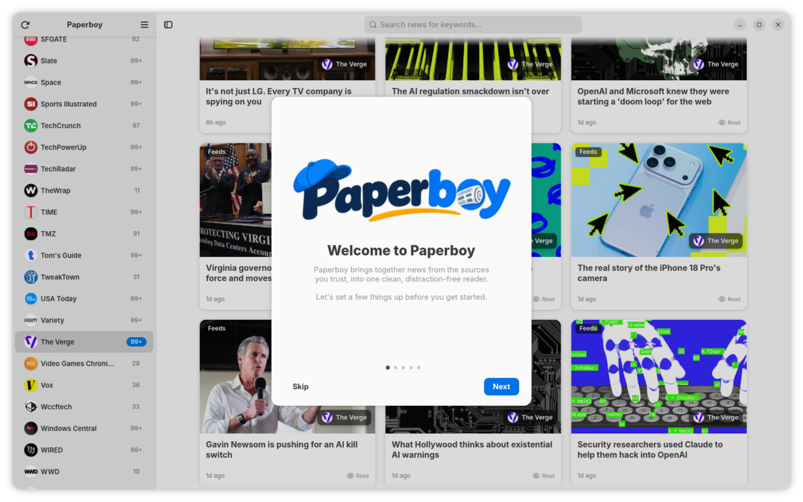</td>
  </tr>
  <tr>
    <td>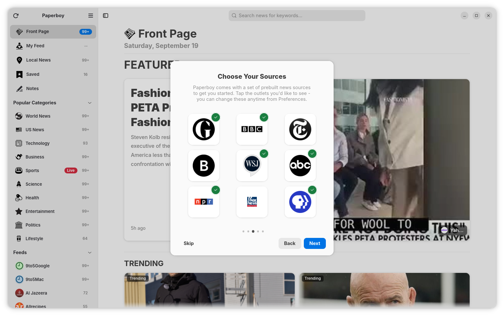</td>
    <td>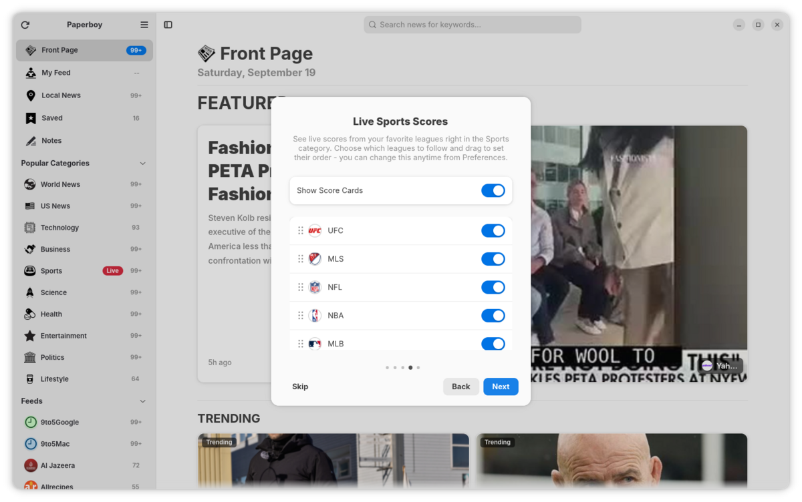</td>
  </tr>
  <tr>
    <td>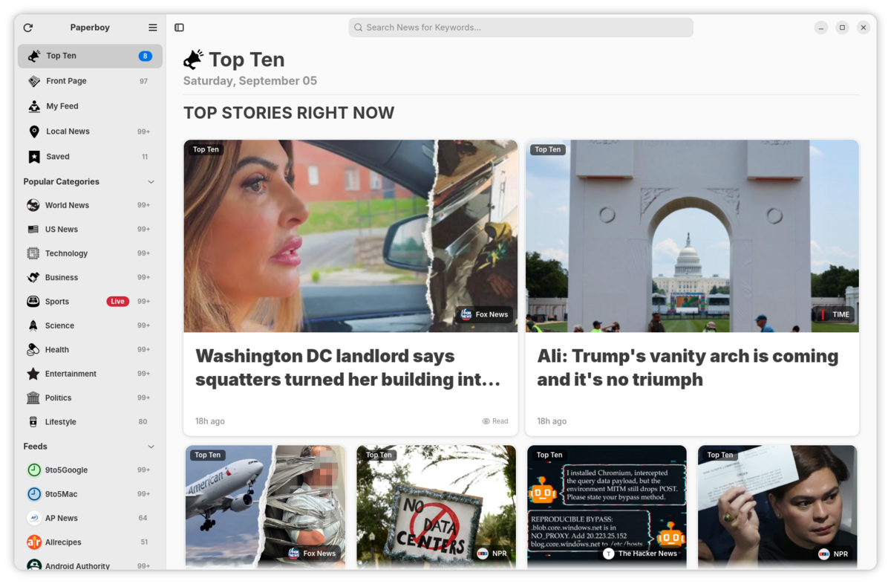</td>
    <td>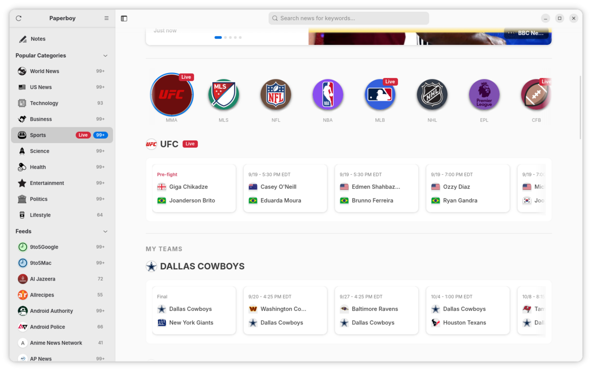</td>
  </tr>
  <tr>
    <td>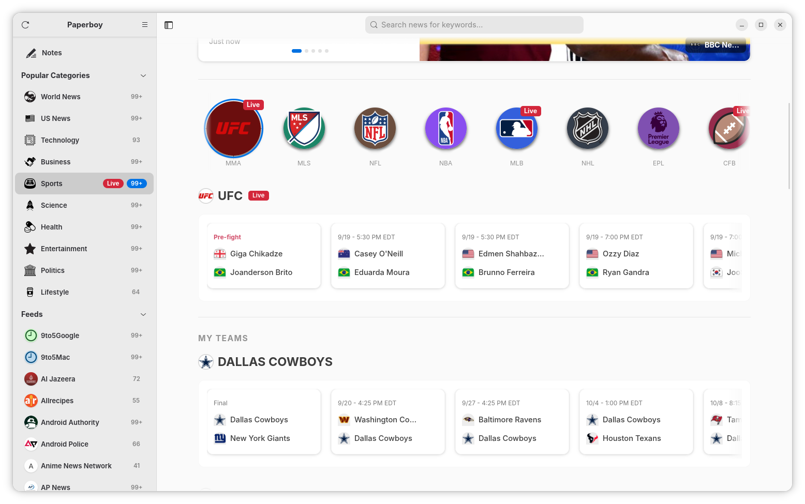</td>
    <td>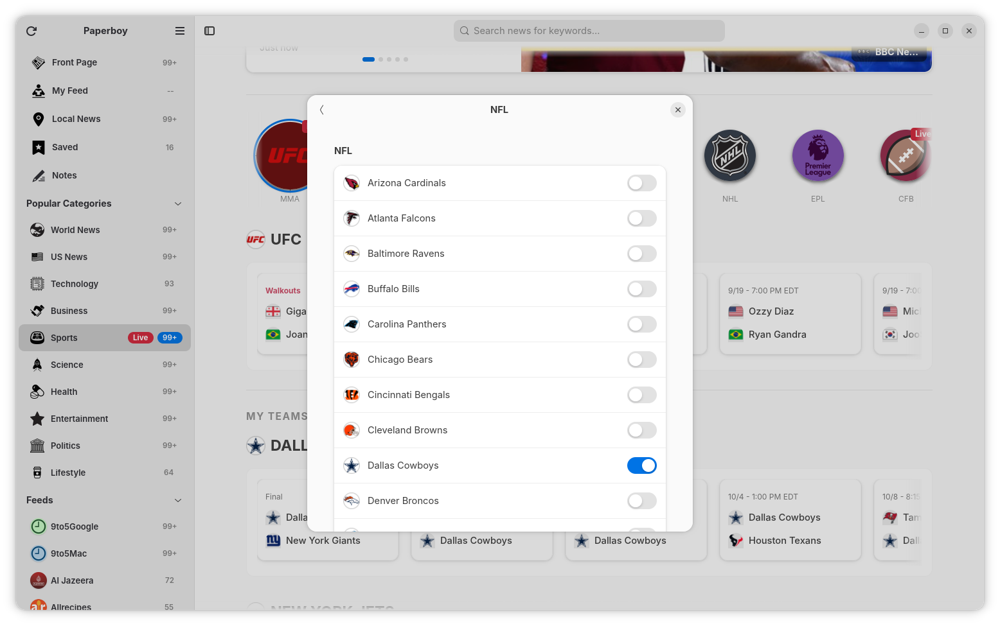</td>
  </tr>
  <tr>
    <td>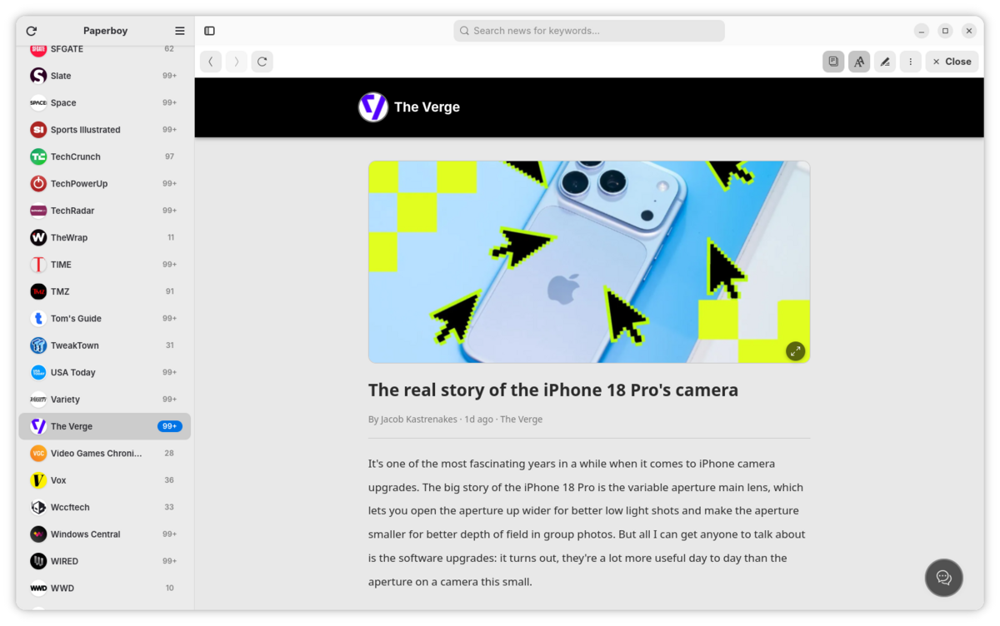</td>
    <td></td>
  </tr>
  <tr>
    <td>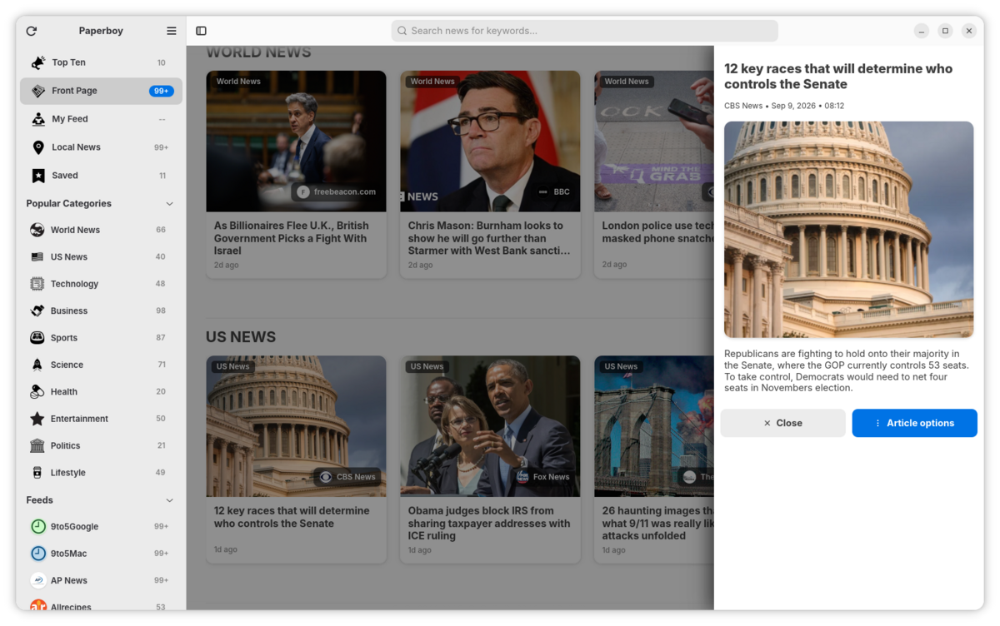</td>
    <td>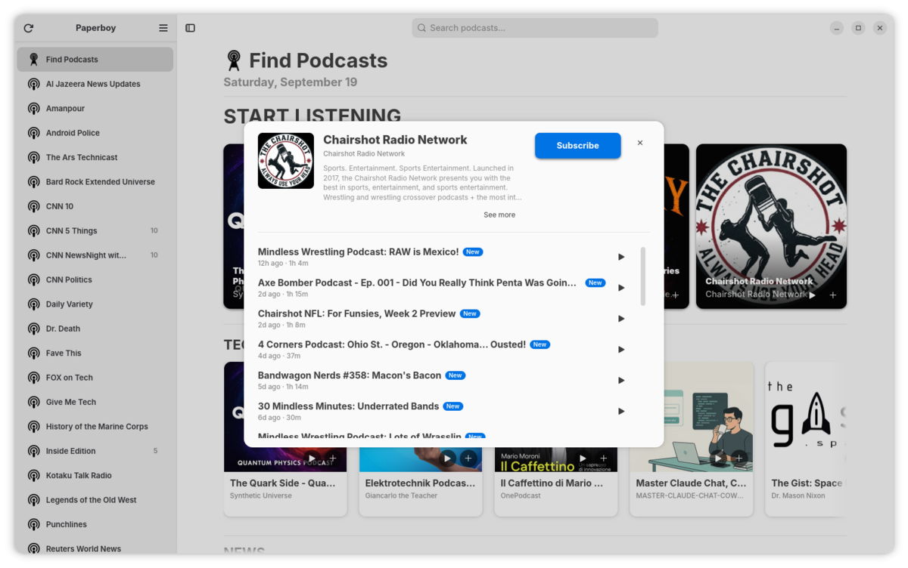</td>
  </tr>
  <tr>
    <td></td>
    <td>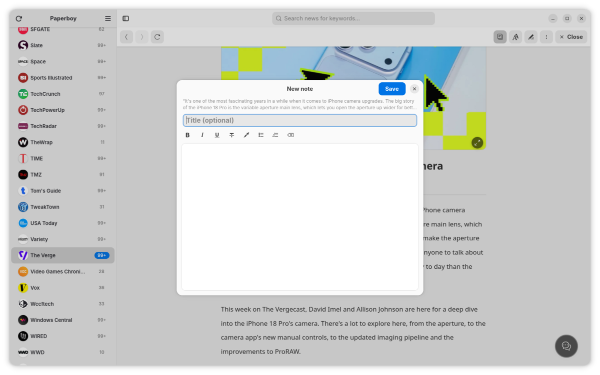</td>
  </tr>
  <tr>
    <td>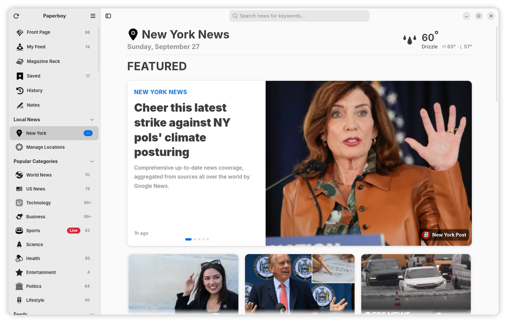</td>
    <td></td>
  </tr>
  <tr>
    <td></td>
    <td>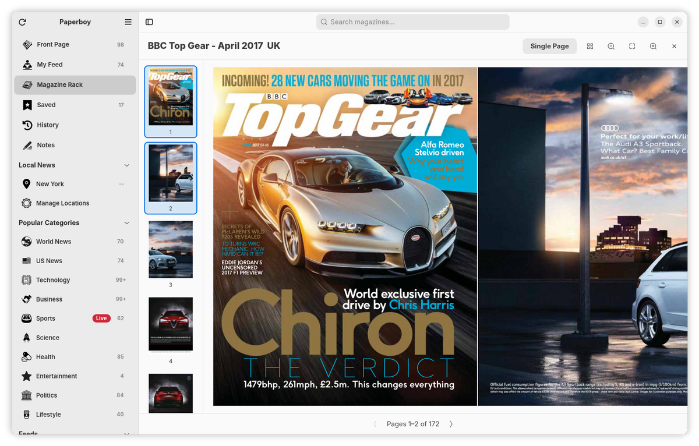</td>
  </tr>
  <tr>
    <td>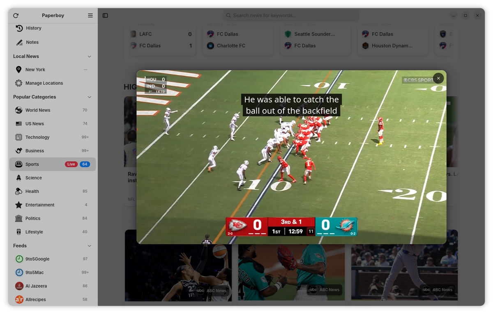</td>
    <td></td>
  </tr>
  <tr>
    <td>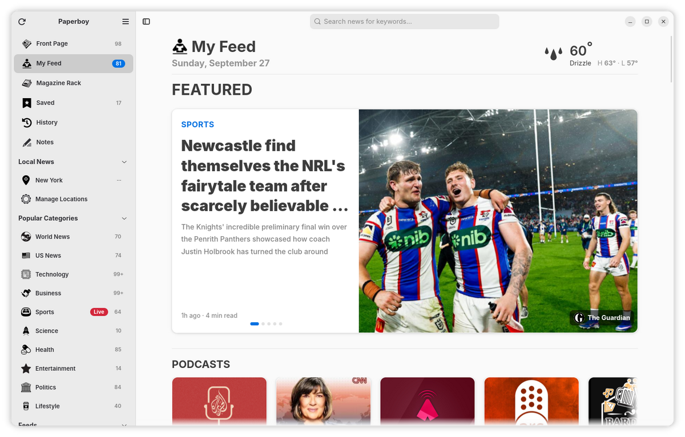</td>
  </tr>
</table>

## About
An all-in-one news app written in Vala, built with GTK4 and Libadwaita. My motivation for building this app because I wanted to have a simple, but beautiful native GTK4 news application similar to Apple News. Feel free to test, change, and contribute back to this project.

## 🚀 Features

### News
- 📰 **Curated sources out of the box** – The Guardian, BBC, FOX News, NPR, PBS, ABC News, Bloomberg, the NYT, and the WSJ.
- ⚡ **Powered by PaperboyAPI** – fetches articles from multiple sources and categories seamlessly.
- 📡 **RSS feeds** – add any RSS feed, follow a site straight from its article cards, rename feeds, and import/export them as OPML.
- 🛠️ **My Feed** – mix and match sources and categories into your own stream, with optional preview rows for sports, markets, podcasts, and magazines.
- 🌍 **Local News** – follow up to 5 cities, each with its own sidebar entry, unread count, and current local weather.
- 🔍 **Global search** – fuzzy search across every cached article's title, source, and URL.
- 🕘 **History & saved articles** – revisit what you've read and keep articles for later.

### Reading
- 📖 **Reader view** – a distraction-free reader with adjustable text size, font, and color scheme, plus a built-in ad blocker for web pages.
- 🎬 **In-app video** – plays an article's lead video (publisher players, YouTube, Vimeo, Dailymotion, MP4 and HLS) without leaving the app.
- 💬 **Native comments** – reads comments from RSS, Disqus, Hacker News, Coral, OpenWeb, and Viafoura in a slide-in pane.
- 📝 **Notes** – attach rich-text notes to articles and browse them all from the Notes view.
- ⏱️ **Reading times** – "N min read" on cards, using the site's own estimate when it publishes one.
- 🖼️ **Image viewer** – open reader images full-size with pinch-to-zoom and panning.
- 🔗 **Share articles** – quickly share articles to other apps.

### More than news
- 🏆 **Sports** – live and recent scores for your leagues and favorite teams, plus ESPN video highlights.
- 📈 **Markets** – major indices and BTC with live intraday charts.
- 🎙️ **Podcasts** – discover and subscribe to shows, with built-in playback, a persistent mini-player, played/new episode tracking, and GNOME media controls (MPRIS).
- 📚 **Magazine Rack** – import and read PDF magazines with two-page spreads, zoom, a table of contents, and custom categories.

### Housekeeping
- 💾 **Backup & restore** – export feeds and podcasts as OPML and notes as JSON, or factory reset from Preferences.
- 🔋 **Considerate refreshing** – feeds refresh on an adaptive schedule that backs off on failures and slows down on metered connections and in power-saver mode.

### WARNING
This app is very much so in an alpha state. It will definitely eat your dogs and throw your kittens outside. It's functional, but it's still very much so a WIP.

## Build dependencies
Paperboy is built with Meson (0.59 or newer), Ninja, the Vala compiler, a C compiler, and `pkg-config`. It links against:

- GTK4 and Libadwaita
- WebKitGTK 6.0 (reader view, video, and page extraction)
- libsoup 3, JSON-GLib, libxml2, GdkPixbuf, Gee, GIO, and SQLite
- GeoClue 2 (Local News location lookup)
- GStreamer, including `gstreamer-player` from the "bad" plugins libraries (podcast playback)
- Poppler (GLib bindings) and Cairo (Magazine Rack PDF rendering)

To play podcasts you'll also want the GStreamer "good" plugins installed at runtime. Package names vary between distributions, so adjust the commands below if yours differ.

Debian / Ubuntu:

```bash
sudo apt update
sudo apt install build-essential valac meson ninja-build pkg-config \
  libgtk-4-dev libadwaita-1-dev libwebkitgtk-6.0-dev \
  libsoup-3.0-dev libjson-glib-dev libgdk-pixbuf-2.0-dev \
  libxml2-dev libgee-0.8-dev libsqlite3-dev libgeoclue-2-dev \
  libgstreamer1.0-dev libgstreamer-plugins-base1.0-dev libgstreamer-plugins-bad1.0-dev \
  libpoppler-glib-dev libcairo2-dev \
  gstreamer1.0-plugins-good
```

Fedora:

```bash
sudo dnf install @development-tools vala meson ninja-build pkgconf-pkg-config \
  gtk4-devel libadwaita-devel webkitgtk6.0-devel libsoup3-devel json-glib-devel \
  gdk-pixbuf2-devel libxml2-devel libgee-devel sqlite-devel geoclue2-devel \
  gstreamer1-devel gstreamer1-plugins-base-devel gstreamer1-plugins-bad-free-devel \
  poppler-glib-devel cairo-devel \
  gstreamer1-plugins-good
```

Arch Linux:

```bash
sudo pacman -S --needed base-devel vala meson ninja pkgconf \
  gtk4 libadwaita webkitgtk-6.0 libsoup3 json-glib gdk-pixbuf2 libxml2 libgee sqlite \
  geoclue gstreamer gst-plugins-base gst-plugins-bad-libs gst-plugins-good \
  poppler-glib cairo
```

openSUSE Tumbleweed:

```bash
sudo zypper in -t pattern devel_basis
sudo zypper in meson vala \
  'pkgconfig(gtk4)' 'pkgconfig(libadwaita-1)' 'pkgconfig(webkitgtk-6.0)' \
  'pkgconfig(libsoup-3.0)' 'pkgconfig(json-glib-1.0)' 'pkgconfig(gdk-pixbuf-2.0)' \
  'pkgconfig(libxml-2.0)' 'pkgconfig(gee-0.8)' 'pkgconfig(sqlite3)' 'pkgconfig(libgeoclue-2.0)' \
  'pkgconfig(gstreamer-1.0)' 'pkgconfig(gstreamer-player-1.0)' 'pkgconfig(gstreamer-audio-1.0)' \
  'pkgconfig(poppler-glib)' 'pkgconfig(cairo)' \
  gstreamer-plugins-good
```

## Building

```bash
# configure the build directory (only once)
meson setup build

# compile
meson compile -C build

# run the built binary
./build/paperboy
```

### Installing system-wide (optional)

```bash
sudo meson install -C build
```

### Flatpak

The manifest builds against the GNOME 49 runtime, which already ships every library Paperboy needs:

```bash
flatpak install flathub org.gnome.Platform//49 org.gnome.Sdk//49
flatpak-builder --user --install --force-clean build-flatpak \
  packaging/flatpak/io.github.thecalamityjoe87.Paperboy.yaml
flatpak run io.github.thecalamityjoe87.Paperboy
```

### AppImage

Put [`appimagetool`](https://github.com/AppImage/appimagetool) somewhere on your `PATH` (the downloaded `appimagetool-x86_64.AppImage` works as-is), then run:

```bash
./packaging/appimage/build-appimage.sh -M
```

`-M` names the output after the version in `meson.build` (for example `paperboy-0.13.1a-x86_64.AppImage`); leave it off to get a plain `paperboy.AppImage`.
